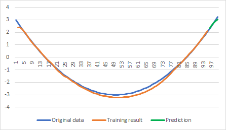
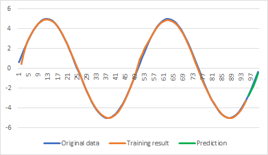
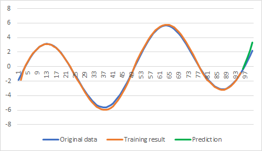

# Time series prediction example with Recurrent ANN

This example demonstrates usage of recurrent ANN for time series prediction task. Similar to the [fc_time_series](../fc_time_series) example, it uses [time series data sets](../data/time-series/). The sample application trains neural network on a subset of the specified data and then uses the trained network to predict some of the data points, which were not included into the training.

Unlike with fully connected network, which has multiple inputs (depending on the number of past values used to predict the next one), the recurrent neural network has only one input. It does not mean that single value is enough to make good quality prediction though. Recurrent networks also require reasonable amount of history data. However, those are fed to network sequentially one by one and the network maintains its own history state.

Training of recurrent network is a bit different however. Since we feed values one by one and network maintains its own state, training dataset needs to be split into sequences, which are then used for training the network using back propagation through time algorithm.

Suppose a dataset with 10 values is provided.

| v0 | v1 | v2 | v3 | v4 | v5 | v6 | v7 | v8 | v9 |
| -- | -- | -- | -- | -- | -- | -- | -- | -- | -- |
|  0 |  1 |  4 |  9 | 16 | 25 | 16 |  9 |  4 |  1 |

Let's assume we would like to predict 2 values and then compare prediction accuracy. This means we need to exclude 2 last values from the provided dataset (not use those for training). Finally, let's assume we want to generate sequences of 4 steps in length. This will create the next 4 training sequences:

```
0 -> 1 -> 4 -> 9 -> 16
1 -> 4 -> 9 -> 16 -> 25
4 -> 9 -> 16 -> 25 -> 16
9 -> 16 -> 25 -> 16 -> 9
```

Each of the above 4 sequences is then generates 4 training samples. For the first sequence those sample are (x – input, t – target output):

| x |  t |
| - | -- |
| 0 |  1 |
| 1 |  4 |
| 4 |  9 |
| 9 | 16 |

Since the 4 sequences we have got are overlapping, we'll get some of the input/output training pairs repeated. However, those will be provided to the neural network with different history. For simplicity, let's assume batch training is not used and each training sequence is provided one by one. Initially the network starts with no history (zero initialized). It takes the first training sample (0 -> 1) and calculates the forward pass. Instead of doing the backward pass after it like fully connected network would do, it then does forward pass for the 2nd training sample, then 3rd, 4th – until the end of training sequence is reached. Once the forward pass is done for all the samples in the sequence, the network then calculates the backward pass in reverse order (from the 4th sample to the 1st). The reason for the above is that during forward pass the network needs to accumulate/maintain its history state, so that output of the network is based not only on the current input, but on the internal state. While on the backward pass it needs to propagate error gradients back through time.

Once one sequence is done, network's state is reset back to zero and then another training sequence is presented to the network.

## Neural network

By default, the sample application creates a 2-layer neural network – first layer is Gated Recurrent Unit (GRU) with 30 neurons and the output layer fully connected with single neuron. The number of recurrent layers and their size can be overridden by using command line option, however.

```C++
// prepare recurrent ANN to train
shared_ptr<XNeuralNetwork> net         = make_shared<XNeuralNetwork>( );
size_t                     inputsCount = 1;

for ( size_t neuronsCount : trainingParams.HiddenLayers )
{
    net->AddLayer( make_shared<XGRULayer>( inputsCount, neuronsCount ) );
    net->AddLayer( make_shared<XTanhActivation>( ) );

    inputsCount = neuronsCount;
}
// add fully connected output layer
net->AddLayer( make_shared<XFullyConnectedLayer>( inputsCount, 1 ) );
```

## Training the network

Assuming training data samples are presented in the correct order (all training samples of one sequence, then all samples of another sequence, etc) and the training context is configured with the right sequence length, the training loop becomes trivial. Note: to keep it simple, this example does not shuffle data before starting each epoch. When training recurrent networks, it is required to shuffle sequences, but not the individual training sample (which would ruin everything).

```C++
// create training context with Nesterov optimizer and MSE cost function
XNetworkTraining netTraining( net,
                              make_shared<XNesterovMomentumOptimizer>( trainingParams.LearningRate ),
                              make_shared<XMSECost>( ) );

netTraining.SetTrainingSequenceLength( trainingParams.SequenceSize );

for ( size_t epoch = 1; epoch <= trainingParams.EpochsCount; epoch++ )
{
    auto cost = netTraining.TrainBatch( inputs, outputs );

    netTraining.ResetState( );
}
```

## Sample output

```
Time Series Prediction example with Recurrent ANN

Input data file  : data/series3.csv
Output data file : data/series3-out.csv
Learning rate    : 0.0500
Epochs count     : 1000
Sequence size    : 20
Prediction size  : 5
Hidden neurons   : 30:30

Loaded 100 time series data points

Created 75 training sequences, 1500 training samples total

1.1252 7.2546 0.2428 0.0930 0.0670 0.2432 0.0562 0.0478 0.0416 0.0368
...
0.0060 0.0060 0.0059 0.0059 0.0059 0.0058 0.0058 0.0058 0.0057 0.0057

Prediction error: min = 0.0021, max = 0.2966, avg = 0.0853
```

## Checking result
Output of the example application is not particularly useful other than checking cost value goes down and checking final prediction error. In addition, the example produces an output CSV file, which contains 3 columns: original data, training result (prediction of single point when providing original data as input) and final prediction (using predicted points to predict new ones).

Below are some of the examples obtained from the [time series data sets](../data/time-series/).


## Parabola


## Sine


## Increasing Sine

